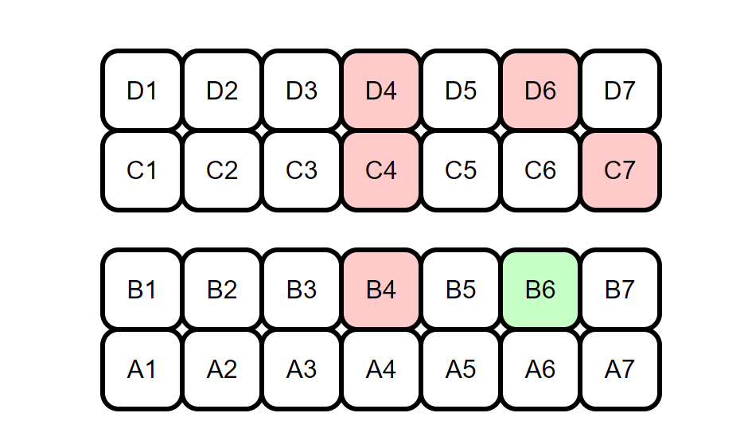

# Endpoints

- [Endpoints](#endpoints)
  - [GET\_ALL\_FLIGHT\_DATA](#get_all_flight_data)
  - [GET\_FLIGHT\_DATA](#get_flight_data)
  - [GET\_ALL\_SEAT\_DATA](#get_all_seat_data)
    - [Index based](#index-based)
    - [ID Based](#id-based)


## GET_ALL_FLIGHT_DATA

Returns an array of all flight data.

> `GET /flights`

```ts
[
    {
        dest: String,       // e.g. YYZ, NRT, etc.
        date: DateTime,     // e.g. 10-29-2023 3:35AM *SHOULD BE IN UTC!!!!
        duration: Number,   // e.g. 600 *THIS IS IN MINUTES
        stops: String,      // e.g. Non-stop, One Stop
        price: Number,      // e.g. 41000 *THIS IS IN HKD
        id: Number,         // e.g. 1
    },
]
```

*Example below:*

```ts
[
    {
        dest: "YYZ",
        date: new Date(Date.UTC(2023,11,29,0,35)),
        duration: 950,
        stops: "Nonstop",
        price: 19720,
        id: "1",
    },
]
```

## GET_FLIGHT_DATA

Returns flight data for one flight. Will take in flight ID as a parameters

> `GET /flights/1`

Will return ONE flight data object:

```ts
    {
        dest: String,       // e.g. YYZ, NRT, etc.
        date: DateTime,     // e.g. 10-29-2023 3:35AM *SHOULD BE IN UTC!!!!
        duration: Number,   // e.g. 600 *THIS IS IN MINUTES
        stops: String,      // e.g. Non-stop, One Stop
        price: Number,      // e.g. 41000 *THIS IS IN HKD
        id: Number,         // e.g. 1
    },
```

*Example below:*

```ts
    {
        dest: "YYZ",
        date: new Date(Date.UTC(2023,11,29,0,35)),
        duration: 950,
        stops: "Nonstop",
        price: 19720,
        id: "1",
    },
```

## GET_ALL_SEAT_DATA

Returns an array of all seat data for a flight. Flight is given as an id

> `GET /seats/1`

Seat data takes the following form:

```ts
    {
        occupied: Boolean,
        price: Number
    }
```

For example:

```ts
    {
        occupied: false,
        price: 1234,
    }
```

**IM NOT SURE WHAT WILL BE EASIER FOR U SO PICK ONE OF THE FOLLOWING SCHEMAS:**

### Index based

Seats need to be returned in a very exact order:



A1 is 1st element

B1 is 2nd element

C1 is 3rd element

D1 is 4th element

A2 is 5th element

```ts
[
    {
        occupied: true,
        price: 1
    },
    {
        occupied: true,
        price: 2
    },
    .
    .
    .
]
```

I will then get the seat data by directly indexing this array.

### ID Based

Depending on how you save the seat data in the database, you can return the JSON object with an array of nested objects.

0,1,2,... is `column + row * NUMBER_OF_COLUMNS` e.g. A2 = 4 as it should be **0 indexed**.

```ts
[
    "0": {
        occupied: true,
        price: 1
    },
    "1": {
        occupied: true,
        price: 2
    },
    .
    .
    .
]
```

**or**

Directly attach the seat name to the object.

```ts
[
    "A1": {
        occupied: true,
        price: 1
    },
    "B1": {
        occupied: true,
        price: 2
    },
    .
    .
    .
]
```